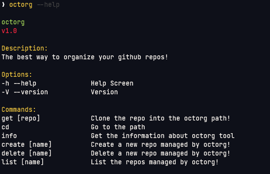
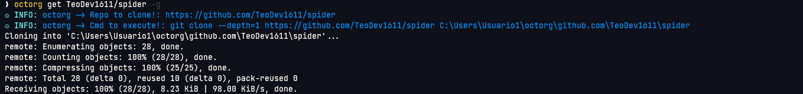
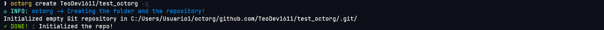
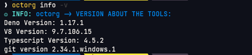
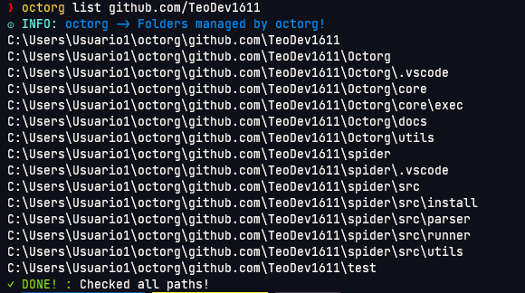

# Octorg

Octocat help you to organize the repositories!

## Why this?

Well exists the [ghq](https://github.com/x-motemen/ghq) tool but is necessary
add new functions to this amazing tool, and this make octorg:

**Add this functions:**

- Remove repository
- Github Template
- Get the repo dir to cd!

## Installation

```
deno install -A -f --no-check --unstable -n octorg --import-map=https://deno.land/x/octorg@1.0/import_map.json https://deno.land/x/octorg@1.0/cli.ts
```

## Demos

- Commands of octorg!



- Get Command!



- Create Command!



- Delete command!


- Info command!



- Cd Command!


- List Command!



## Bugs by octorg?

Well I improve octorg with a issue bug report command you need run
`octorg info -i` and open the browser with the issue page

## Contribute to octorg

1. Make a Fork to this repository
2. Make a branch with the feature to add
3. Setup the tools with this make cmd:

```sh
# Setup the formatter Linux and MacOS
make install-sh
# Setup the formatter Windows
make install-win
# Formatting
make fmt
```

3. Use the conventional commits guide
   [more information here](https://www.conventionalcommits.org/en/v1.0.0/)
4. Make a pull request with a explanation what you changes or features
5. Review your pull request :shipit:
6. Merge the pull request or request changes
7. Done! :smiley:

---

Made with :heart: in Ecuador
